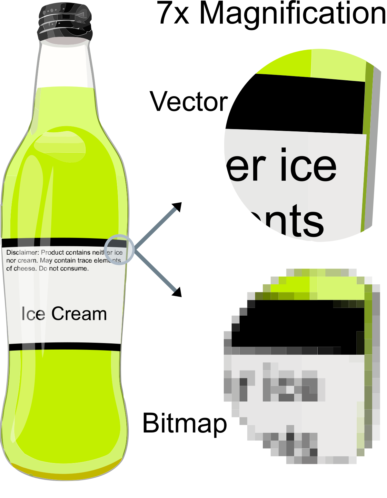
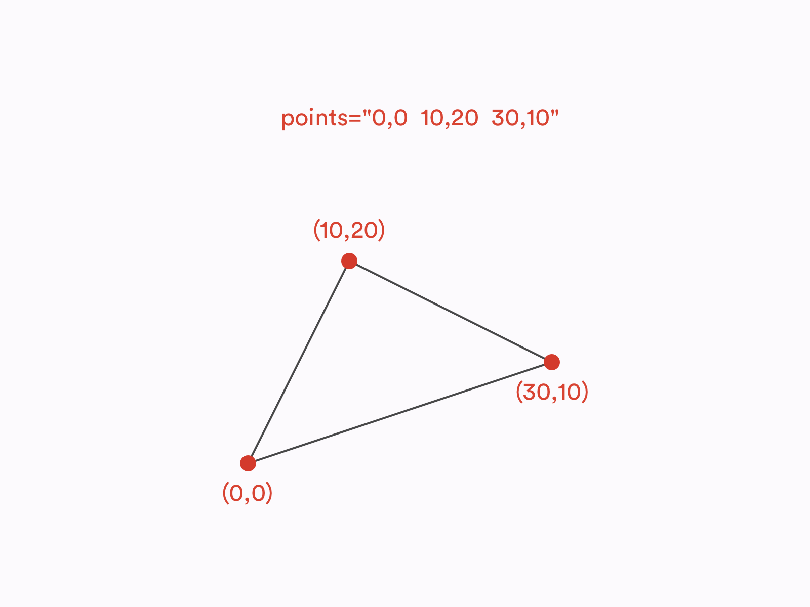

# Documentation
Documentation regarding various topics such as the engine code, use of libraries and technical concepts. Useful for those who wish to use their own custom election maps.
* [Map Types](#map)
    - [SVG](svg)
    - [GeoJSON](geojson)
* [d3.js Bounding Boxes](#bounding)
    - [The Concept](concept)
    - [Geographical vs Planar](comparison)
    - [Uses](uses)

## Map Types 
This project makes use of two distinct map filetypes. Although they both end up as inline SVGs once the initial loading sequence is complete, they start off as two wildly different filetypes.

### SVG (Vectors) 
SVG stands for Scalable Vector Graphic, it is the standard digital filetype used for vector graphics. What is a vector graphic, you may ask? A vector graphic is a type of image file which, unlike .jpegs or .pngs, is not made out of individual coloured pixels, but rather a sets of coordinates and commands which tell the computer to draw lines between certain given points. This means that when zooming into a vector graphic the quality never degrades, hence "scalable". Each distinct line or shape made with a set of points is called a "path". In the vector graphics used in this project, each electoral district is one path.

 

SVGs are written in XML, a language similar to HTML. This means that to load SVG maps all the code has to do is to read the SVG file and copy the code over to the HTML document. A significant disadvantage to SVGs is that it's hard to make them dynamic, such as changing the geographical projection of the map or dynamically appending place names to each district, as can be done with topojson/GeoJSON maps.

Most election maps you see on wikipedia are SVGs. In this project most hypothetical maps are SVGs and most real world maps are GeoJSON files, the latter fact is due to the fact that most governments release the maps online as GeoJSON files.

SVGs can be opened and edited using Inkscape, it is important to note that editing SVGs is very different to editing simple images - there is a steep learning curve involved.

### GeoJSON / topojson (Geographical Coordinates) 
GeoJSON a standard fileformat for representing simple polygonic geographic features, typically roads, country boundaries or in the case of this project electoral boundaries. It is similar to vector graphics as in they both use sets of coordinates to draw their shapes, however GeoJSON uses real life longitudinal and latitudinal coordinates whilst vector graphics use a flat plane of computer pixels. Due to the fact that GeoJSON uses geographical coordinates, and that the earth is a spherical object, the projection plays a major role in the displayal of GeoJSON maps. The same file may look very different with a Mercator projection than with an Augustian projection.

GeoJSON files can also include non-spatial attributes of geographic features, such as names, addresses, any data which is relevant to the feature etc.

GeoJSON files are based on the JSON format, a javascript-similar object notation. The code in this project requires the use of a special GeoJSON file format, a topojson file. It is in essence the same, except that the data itself is reorganised in a more logical manner and that the data is simplified where possible making the files much smaller. In this project there is a special function which transforms the geographical coordinates into vector graphic coordinates, based on which geographical projection is used.

GeoJSONs are preferred to SVGs because they are easier to customise with code, however they can't easily be opened and edited like SVGs. For that you need complex GIS software such as ArcGIS or QGIS.

## Bounding Boxes 

### The Concept 

### Geographical vs Planar 

### Use in this Project 
