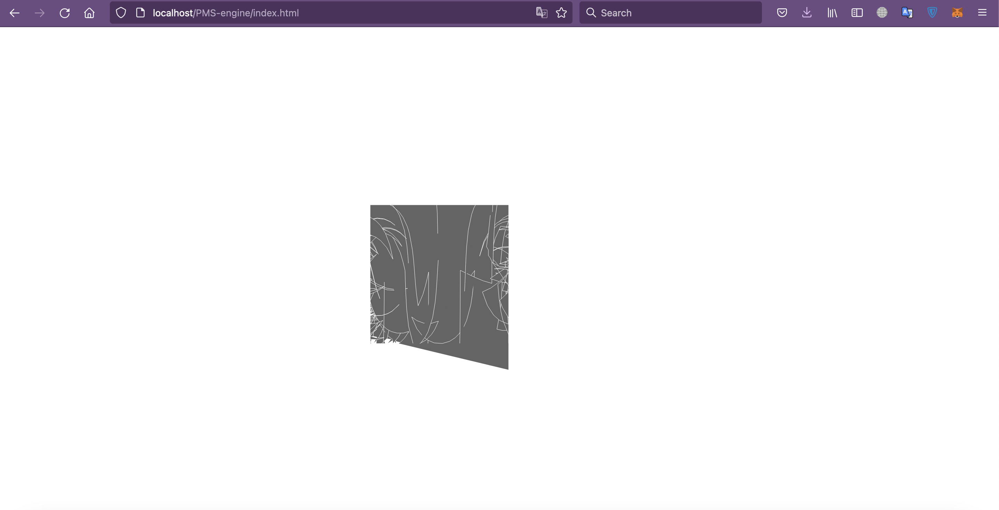
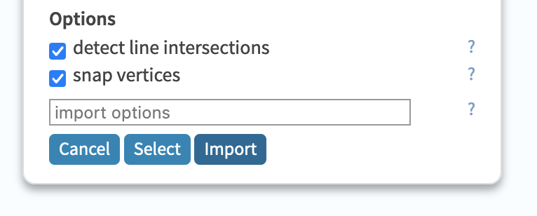
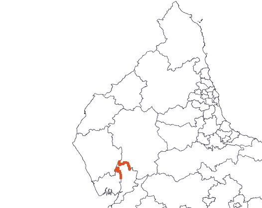

# Documentation
Documentation regarding various topics such as the engine code, use of libraries and technical concepts. Useful for those who wish to use their own custom election maps.
* [Uploading Custom Maps (NOT FUNCTIONAL YET)](#custom)
    - [DISCLAIMER!](#disclaimer)
    - [Instructions](#instructions)
    - [Troubleshooting TopoJSON maps](#troubleshooting)
* [Map Types](#map)
    - [SVG](#svg)
    - [GeoJSON](#geojson)
* [d3.js Bounding Boxes](#bounding)
    - [The Concept](#concept)
    - [Geographical vs Planar](#comparison)
    - [Uses](#uses)


## Uploading Custom Maps (NOT FUNCTIONAL YET) <a name="custom"></a>
### DISCLAIMER! <a name="disclaimer"></a>


To upload your own maps you will need to host the website yourself, preferably on a localhost. Please take the [terms and conditions](LICENSE) into consideration when doing this.

### Instructions <a name="instructions"></a>
For this to work you will need either SVG or topojson maps. They have to be as simple as possible without any additional texts or images on them. It should only the electoral districts and nothing else. Note that the main object on the topojson maps has to be named `boundaries`.

Once you have obtained your map navigate to the [assets/maps](assets/maps) folder and the appropriate subfolder, depending if it is a SVG or GeoJSON, and copy the map to that folder.

Then navigate to the [script/map/dict.js](script/map/dict.js) file and under the `const` declaration at the top, paste this with the appropriate text filled:
```js
filepath[CUSTOM_NAME] = PATH_TO_MAP;
```
for example:
```js
filepath["adoria"] = "./assets/maps/svg/Adoria_NationalAssembly_HYP.svg";
```

### Troubleshooting TopoJSON maps <a name="troubleshooting"></a>
There may be a few cases where the map loads as a jumbled mess of lines and shapes or it does not appear entirely.



#### console error
This may be due to an error in the formatting of the topojson file, check the console for errors and then check if you have named the topojson object `boundaries` as states in the instructions.

#### initial map projection
The d3.js and topojson libraries only accept maps which are in the WGS84 projection, the standard projection for many geographic services and engines. Maps in this projection are typically very wide and distorted.

To convert to this projection, import the map to [mapshaper](https://mapshaper.org/) and open the console. Then type in the following command:
```
$ -proj wgs84
```
If this returns an error going along the lines of `Unable to project -- source coordinate system is unknown` then that means that you have to specify the current projection of the map. The projection is typically specified on the website you got the map from, it looks a little like `EPSG:##### ETRS## / UTM zone ###`. All you will need is the "EPSG:#####", this is the universal ID for the projection. Using this ID execute the following command:
```
$ -proj from='EPSG:#####' wgs84
```
If you can't find the EPSG ID, and only have the UTM zone then try this command:
```
$ -proj from='+proj=utm +zone=###' wgs84
```
If you can't find any info on the initial projection you will need to find an SVG version of the map.

#### badly drawn shapes
If it still doesn't work it may be due to badly drawn shapes. This occurs when the original creators of the maps leave an error in the coordinates. To solve this issue go to [mapshaper](https://mapshaper.org/) and import the faulty map. On the loading screen tick the "snap vertices" option and then import. This should solve the majority of misplaced borders.



Once you have loaded the map, check if there are still orange points left at some of the borders. This indicates that there are still some errors in the lines.



To solve this click on console in the top right and type and execute the following command:
```
$ -clean
```
This should then clean up any errors left. Make sure that once you have executed the command, that the console states that all of the shapes have been retained. Otherwise it means that a district had to be deleted due to it being too buggy.


## Map Types <a name="map"></a>
This project makes use of two distinct map file types. Although they both end up as inline SVGs once the initial loading sequence is complete, they start off as two wildly different file types.

### SVG (Vectors) <a name="svg"></a>
SVG stands for Scalable Vector Graphic, it is the standard digital filetype used for vector graphics. What is a vector graphic, you may ask? A vector graphic is a type of image file which, unlike .jpegs or .pngs, is not made out of individual coloured pixels, but rather a sets of coordinates and commands which tell the computer to draw lines between certain given points. This means that when zooming into a vector graphic the quality never degrades, hence "scalable". Each distinct line or shape made with a set of points is called a "path". In the vector graphics used in this project, each electoral district is one path.

 

SVGs are written in XML, a language similar to HTML. This means that to load SVG maps all the code has to do is to read the SVG file and copy the code over to the HTML document. A significant disadvantage to SVGs is that it's hard to make them dynamic, such as changing the geographical projection of the map or dynamically appending place names to each district, as can be done with topojson/GeoJSON maps.

Most election maps you see on wikipedia are SVGs. In this project most hypothetical maps are SVGs and most real world maps are GeoJSON files, the latter fact is due to the fact that most governments release the maps online as GeoJSON files.

SVGs can be opened and edited using Inkscape, it is important to note that editing SVGs is very different to editing simple images - there is a steep learning curve involved.

In this project SVGs are processed with `d3.xml(file).then(data =>{});` function.

### GeoJSON / topojson (Geographical Coordinates) <a name="geojson"></a>
GeoJSON is a standard file format for representing simple polygonic geographic features, typically roads, country boundaries or in the case of this project electoral boundaries. It is similar to vector graphics as in they both use sets of coordinates to draw their shapes, however GeoJSON uses real life longitudinal and latitudinal coordinates whilst vector graphics use a flat plane of computer pixels. Due to the fact that GeoJSON uses geographical coordinates, and that the earth is a spherical object, the projection plays a major role in the displayal of GeoJSON maps. The same file may look very different with a Mercator projection than with an Augustian projection.

GeoJSON files can also include non-spatial attributes of geographic features, such as names, addresses, any data which is relevant to the feature etc.

GeoJSON files are based on the JSON format, a javascript-similar object notation. The code in this project requires the use of a special GeoJSON file format, a topojson file. It is in essence the same, except that the data itself is reorganised in a more logical manner and that the data is simplified where possible making the files much smaller. In this project there is a special function which transforms the geographical coordinates into vector graphic coordinates, based on which geographical projection is used.

GeoJSONs are preferred to SVGs because they are easier to customise with code, however they can't easily be opened and edited like SVGs. For that you need complex GIS software such as ArcGIS or QGIS.

In this project topojsons are processed with `d3.json(file, data =>{});` function.

## Bounding Boxes <a name="bounding"></a>
Bounding boxes are an important concept to learn if you wish to progress in the field of geographical programming. It is a quite complex concept to get your head around, which is why it has been given so much attention in this documentation.

### The Concept <a name="concept"></a>
Bounding boxes are boxes drawn around the outline of a shape. It is a rectangle which is as wide and long as the maximum width and length of the object. For clarification look at the image of a bounding box on a vector path below.

It is important to note that SVGs draw paths from the top left corner, not the bottom left corner as would be standard in mathematics. Hence the origin is the top left corner, and all coordinates are relative to that point.


Bounding boxes are calculated with the d3.js library with the bounds function. This function finds the bounding box of certain features, features in this case being singular paths or collections of paths. This function returns a two dimensional array with the format of `[[minX, minY], [maxX, maxY]]`. These are the coordinates of the corners of the box, only four are needed because some coordinates repeat.
```js
var bounds = path.bounds(features);
//or
var bounds = d3.geoBounds(features);
```
Like this the width and height of paths can easily be calculated without complex functions. For example the width can be calculated with `maxX-minX`, and the height with `maxY-minY`. The center of the object can then be calculated by dividing the width in two and the height in two;
```js
let center = [width / 2, height, 2];
```

### Geographical vs Planar <a name="comparison"></a>
As you may have noticed in the previous segment, there are two functions which calculate shape bounds. One, `path.bounds();`, is meant for vectors on a computer screen and the other, `d3.geoBounds();`, is used to calculate the bounds of a shape in terms of longitude and latitude. The latter is subject to geographical projections and can be used to find the centre of geographic features. This is useful if you want to centre a map. The geobounds function can only really be used in the context of a GeoJSON/topojson file since it takes geographical coordinates as an argument.

### Use in this Project <a name="uses"></a>
In this project bounding boxes are primarily used to centre maps correctly. Here is a function which calculates the necessary scale a GeoJSON map has to be enlarged by to fit the browser window perfectly:
```js
scale : function(features, width, height) {
        const path = d3.geoPath().projection(d3.geoMercator().scale(1));

        let bounds = path.bounds(features);

        let scale = 0.95 / Math.max(
            (bounds[1][0] - bounds[0][0]) / width,
            (bounds[1][1] - bounds[0][1]) / height
        );

        return scale;
    },
```
The function starts off by defining the path, these are the sets of coordinates which will be used to draw the map on the browser. Then the bounds of the path are calculated with `path.bounds(features);`.

Now comes the tricky part. To calculate the scale, the width and height of the path are calculated. This is done by subtracting the largest x/y coordinate from the smallest x/y coordinate.
```js
bounds[1][0] - bounds[0][0] // width in px
bounds[1][1] - bounds[0][1] // height in px
```
The width and height of the path are then divided by the width and height of the browser window respectively. In the code the variables `width` and `height` are the width and height of the browser window.
This will return the amount of space the path takes up as a percentage of the entire window width/height. By dividing 95% (0.95) by this number, it will return the factor by which the path has to be scaled to take up 95% of the screen width. The number 95% is chosen here to give a 2.5% margin at the edges of the path.
You may notice the `Math.max(...);` function in the code; this is used to find if the width or the height of the path is largest. If, for example, the map would be scaled according to the smaller length parts of the complimentary side would stick out past the window borders.


The bounds feature is also used to centre the map so that the centre of the given shape corresponds with the centre of the window. This is needed because normally geographical features are drawn relative to the cartographic origin (0N 0W). This function however changes the centre of the map to that of the geographic centre of the given shape.
```js
centre : function(features) {
        const bounds = d3.geoBounds(features);

        let center = [
            (bounds[1][0] + bounds[0][0]) / 2,
            (bounds[1][1] + bounds[0][1]) / 2
        ];

        return center;
    }
```
